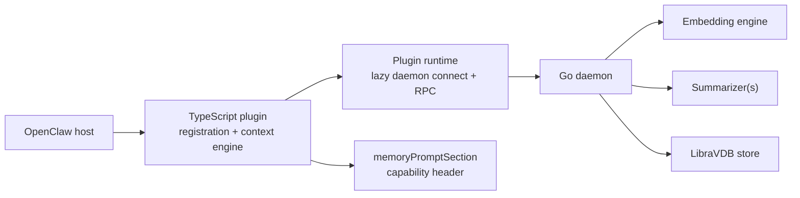

# System Architecture

This document describes the current implemented architecture at a public,
operational level. It intentionally avoids implementation anchors and detailed
internal sequencing.

## Overview

LibraVDB Memory is split into two cooperating pieces:

- a TypeScript OpenClaw plugin that owns the `memory` and `contextEngine`
  slots
- a Go sidecar daemon that owns storage, retrieval, and compaction

The plugin keeps the host integration light and stable. The daemon keeps the
data path local-first and handles the expensive memory operations outside the
main chat process.

## Component Map

## Runtime Flow

### `memoryPromptSection`

The memory prompt hook returns a small static capability header. It is not the
main retrieval path.

### `ingest`

Session messages are written into the sidecar-backed store. User turns may also
be promoted into durable user memory after gating.

### `assemble`

The context engine queries the relevant memory scopes, ranks the results, fits
them to the current token budget, and injects the selected items as synthetic
system messages.

### `compact`

Compaction is explicit rather than background-only. The host can request a
compaction pass, and the system then decides whether the current session is
eligible. When it does compact, it preserves the newest working context, turns
older content into smaller summaries, and keeps the raw recent tail intact.

If the input is too small or the compactable portion does not clear local
thresholds, compaction declines instead of forcing a rewrite.

## Current Boundaries

- `memoryPromptSection` stays lightweight
- retrieval happens in `assemble`
- compaction is separate from prompt construction
- lifecycle hints such as `before_reset` and `session_end` are advisory
- the sidecar is the source of truth for stored memory state

## Failure Handling

The plugin is designed to degrade gracefully:

- if the daemon is unavailable, prompt assembly continues without recall
- if compaction fails, the active session is not blocked
- if summarization is unavailable, the system falls back to the safer path

That keeps the chat usable even when the memory backend is temporarily down.

## Why This Shape

This architecture keeps the host integration simple while still supporting:

- separate session, durable-user, and global scopes
- bounded prompt assembly
- explicit compaction
- local-first storage and retrieval

In short, the plugin owns the lifecycle contract, and the sidecar owns the
heavy lifting.
